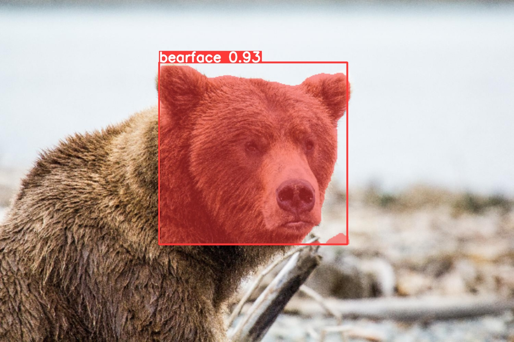

# AI for Bears

This folder contains data and work done during the AI for bears
challenge organized by [FruitpunchAI](https://www.fruitpunch.ai/).

## Structure, organisation and conventions

The project is organized following the [cookie-cutter-datascience
guideline](https://drivendata.github.io/cookiecutter-data-science/#directory-structure).

### Code

The code is organised in different projects, namely `beardetection`,
`bearfacedetection`, `bearfacesegmentation`, `bearidentification` and
`bearedge`.

### Data

All the data lives in the `data` folder and follows some [data engineering
conventions](https://docs.kedro.org/en/stable/faq/faq.html#what-is-data-engineering-convention).
Each project should use these subfolders according to their project names (eg.
`data/05_model_input/beardetection`).

### Notebooks

The notebooks live in the `notebooks` folder and are also keyed by the project
names.

### Scripts

The scripts live in `scripts` folder and are keyed by the project names.

### Makefile

A Makefile makes it easy to prepare commands and execute them in a DAG fashion.
If we need something more involved for running code, we will add it later.

## Setup

Create a virtualenv using your tool of
choice (eg. conda, pyenv, regular python,
...) and activate it.

```sh
conda create -n fruitpunch_bears python=3.9
conda activate fruitpunch_bears
```

Then one can run the following command to install the python dependencies:

```sh
make setup
```

## Run/Write/Edit Notebooks

Run the following command to start a jupyter lab environment and start editing/running your notebooks:

```sh
make dev_noteboook
```

## Download the datasets

### Provided datasets (HackThePlanet, BearID, SLU, ...)

Install [rclone](https://rclone.org/install/) and configure a remote for
your Google Drive following this
[documentation](https://rclone.org/drive/).

```sh
make download_dataset
```

### Roboflow bearfacedetection dataset

Find the private key on
[roboflow](https://app.roboflow.com/fruitpunch-ai-private-workspace-7nsdr/bearface-lk7vt/1).
Click on Export Dataset, select YOLOv8
format and show download code. The raw
URL is displayed and the private key is
located after the `key` parameter:
`https://app.roboflow.com/ds/b8vuUrGhDn?key=***`

One can use the following command:

```sh
PRIVATE_KEY=findmeonroboflow make download_roboflow_bearfacedetection
```

Or can export the `PRIVATE_KEY` as follows before running the subsequent commands:

```sh
export PRIVATE_KEY=findmeonroboflow
```

### All

To download all data, run the following command:

```sh
export PRIVATE_KEY=findmeonroboflow
make data
```

## bearfacedetection

In this section, we describe how to train the bearfacedetection object detector.


### Fast Track for bearfacedetection

To download the data, prepare it, train an object detector and run
inference, one can run the following command:

```sh
make bearfacedetection
```

### Labeling

We had to relabel the provided dataset (3359 bear face images from
BearID) using Roboflow. We wanted to include the ears and mouths of the
bears.

#### Roboflow Instructions

Adjust the bounding box to accurately encompass **the entire bear head**, ensuring it covers **both ears**, the **nose** and the **mouth**. 
Strive for a compact bounding box that encapsulates the complete head and fur while minimizing unnecessary space.

### Build the model input

YOLOv8 models use a very specific folder structure to be trained.

```sh
$ tree -L 2 .
.
├── data.yaml
├── train
│   ├── images
│   └── labels
└── val
    ├── images
    └── labels
```

with the data.yaml file being something like so:

```yaml
train: ./train/images
val: ./val/images
nc: 1
names:
  - bearface
```

To generate this input from the `data/01_raw` data, one should use the
following commands:

```sh
make bearfacedetection_data
```

It should populate the `data/04_feature` and `data/05_model_input` folders.

### Training bearfacedetection

#### Baselines

##### Golden dataset

Run the following command:

```sh
make bearfacedetection_train_baseline_golden_dataset
```

_Note_: Training on CPU is possible with this setup but can take about 10/15minutes.

##### Roboflow relabelled dataset

Run the following command:

```sh
make bearfacedetection_bearfacedetection_train_baseline_roboflow
```

#### Train all

To train all models, run the following command:

```sh
make bearfacedetection_train
```

### Inference with bearfacedetection

Run the following command:

```sh
make bearfacedetection_train_baseline_golden_dataset
```

It should populate the `data/07_model_output` with predictions from the
finetuned model.

## bearfacesegmentation

In this section, we describe how to train and run the bearfacesegmentation
segmentor model.



### Generate chips

#### Test the setup with test images

Some test images are provided to test that the chip generation script works properly.
The test images are located in `data/09_external/bearid/images/bears/`.

Use the following python script (change your parameters as needed):

```sh
python ./scripts/bearfacesegmentation/chips/generate.py \
  --source-dir ./data/09_external/images/bears/ \
  --save-path ./data/07_model_output/bearfacesegmentation/chips/test/ \
  --instance-segmentation-model-weights ./data/06_models/bearfacesegmentation/yolov8/roboflow_relabelled_current_best/weights/best.pt \
  --loglevel "info"
```

The following chips should be generated in your `save-path`:

  

#### Generate BearID chips

Make sure that the bearID dataset is on your machine and then use the following
command:

```sh
make bearfacesegmentation_yolov8_generate_chips
```

To run it on other images, one can run the following command:

```sh
python ./scripts/bearfacesegmentation/chips/generate.py \
  --source-dir ./data/01_raw/BearID/images/ \
  --save-path ./data/07_model_output/bearfacesegmentation/chips/yolov8/ \
  --instance-segmentation-model-weights ./data/06_models/bearfacesegmentation/yolov8/roboflow_relabelled_current_best/weights/best.pt \
  --loglevel "info"
```

### Fast Track for bearfacesegmentation

To download the data, prepare it, train an object detector and run
inference, one can run the following command:

```sh
make bearfacesegmentation
```

___Note___: the bearfacedection command should be run prior to this
command.

### Download SAM checkpoint weights

Run the following commands:

```sh
make download_sam_weights
make download_sam_hq_weights
```

### Prepare the data to train the bearfacesegmentation models

```sh
make bearfacesegmentation_data 
```

### Train the face segmentors

```sh
make bearfacesegmentation_train
```

## bearfacelandmarkdetection

In this section, we describe how to train and run the bearfacelandmarkdetection
keypose detector.


### Fast Track for bearfacelandmarkdetection

To download the data, prepare it, train an object detector and run
inference, one can run the following command:

```sh
make bearfacelandmarkdetection
```

### Prepare the data to train the bearfacelandmarkdetection models

```sh
make bearfacelandmarkdetection_data
```

### Train the bearfacelandmarkdetection models

```sh
make bearfacelandmarkdetection_train
```

## Tools

- [Gitlab Repositories](https://gitlab.com/groups/fruitpunch/projects/ai-for-bears)
- [Notion Board](https://www.notion.so/fruitpunch/AI-for-Bears-91a90f10263a421083a2cb075ffe53a3)
