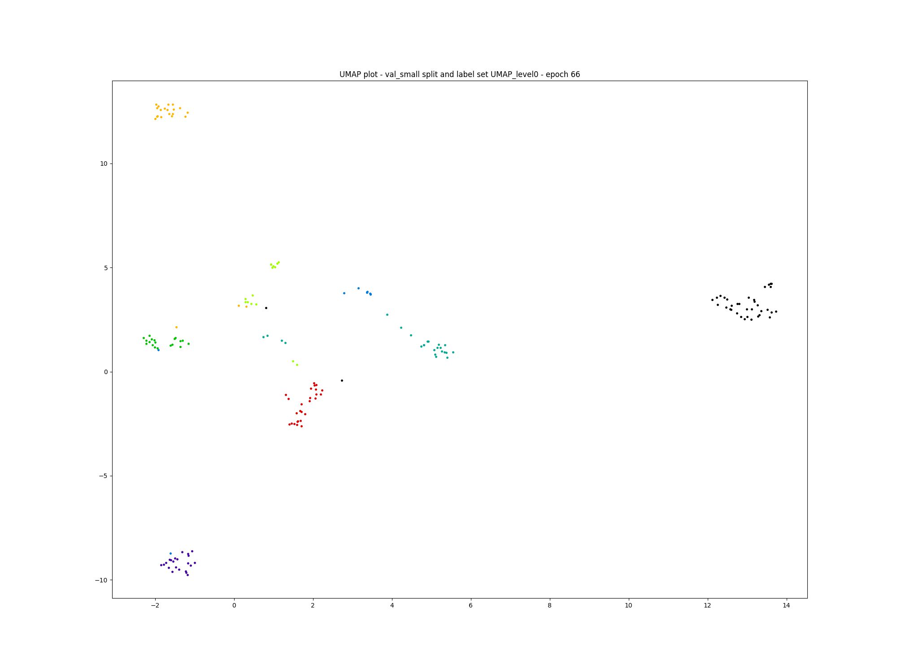

# bearidentification

In this section, we describe how to train and run the
bearidentification model.


## Data

### Chips

A chip is a segmented bear face with background removed.

Some examples below:

  

Run the following command to install the chips:

```sh
make bearidentification_data_install_chips
```

If you are curious and would like to know how they are generated, check out the
[documention for bearfacesegmentation](./bearfacesegmentation.md)

### Datasplits

We decided to perform two distinct types of datasplits to evaluate our models
for different use cases.
1. __Splitting by individuals__: It allows to  assess how good the model is at
   identifying and clustering unseen individuals.
2. __Splitting on the provided BearID split__: The BearID team provided a
   curated split where individuals are spread across the different
train/val/test splits, avoiding data leaks of images taken the same day for the
same individual (bursts of images for instance).

To generate these datasplits, run the following command:

```sh
make bearidentification_data_split
```

## Training

A Metric Learning approach is taken to learn a good embedding space for
bear faces.

To train all different models and experiments, use the following command:

```sh
make bearidentification_metriclearning_train
```

To train the best models, run the following command:

```sh
make bearidentification_metriclearning_train_best
```

To train the baselines, run the following command:

```sh
make bearidentification_metriclearning_train_baselines
```

### Hyperparameter Search

Random hyperparameter search is setup and can be run with the following command:

```sh
make bearidentification_metriclearning_train_hyperparameter_search
```

By default, it generates 10 configs using the parameter
space and setup a train run for each, logging the
results.

## Evaluation

To aggregate the performances of the diffent trained models in a csv
file, one can run the following command:

```sh
make bearidentification_metriclearning_eval_summary
```

For each model, an evaluation folder is created with the following artifacts:

- embeddings visualizations for the different splits (train, val, test)

 

- metric reports csv file that contains the following metrics for the different splits (train/val/test): __precision@1/3/5/10, AMI, NMI, mAP__

### Embeddings

Visualize the embeddings on the different splits is a great way to gain confidence that the model works as expected. Is it possible to visualize how the model improve its embeddings overtime.


## Packaging the pipeline

Once the bearfacesegmentation model and the bearidentification model are
trained, one can package the end to end pipeline to make it easy to ship
it around and to make predictions.

```sh
make package_pipeline
```

If you downloaded a packaged pipeline archive (usually a
`packaged_pipeline.zip` file) you can install it with the following
command:

```sh
make install_packaged_pipeline
```

We are now ready to start making predictions with the pipeline.

## Prediction

Run the following command to make a prediction on the provided bear image.

```sh
make identify_default
```

## Fast Track

To run the datasplit, the training and the evaluation at once, run the
following command:

```sh
make bearidentification_metriclearning
```
